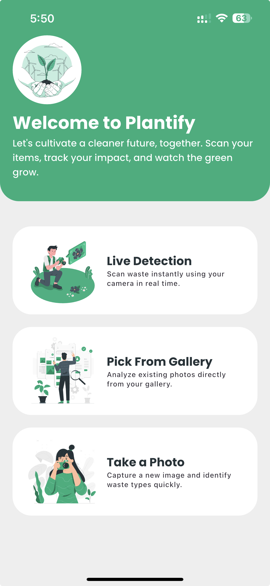
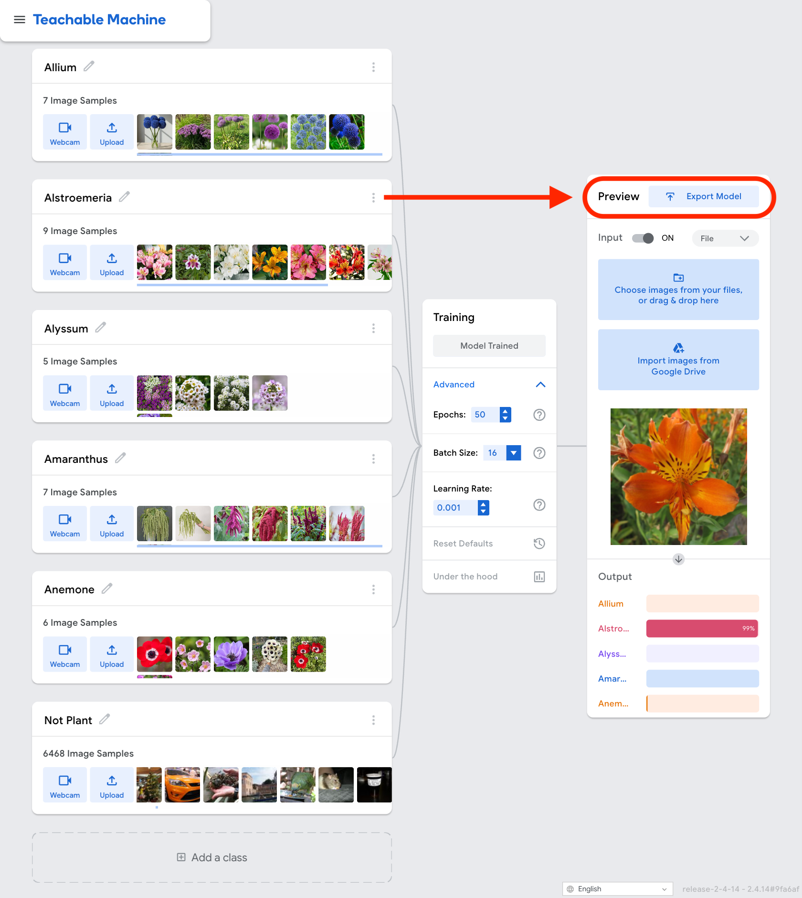
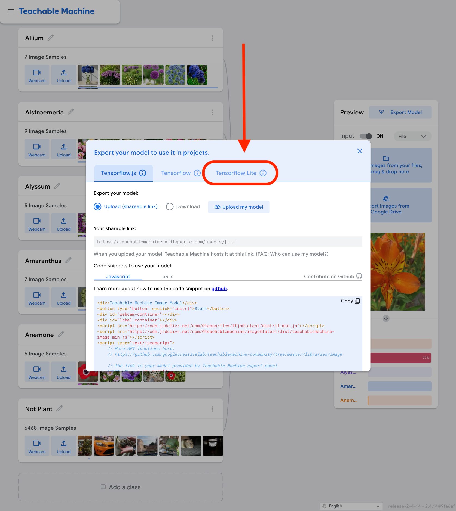
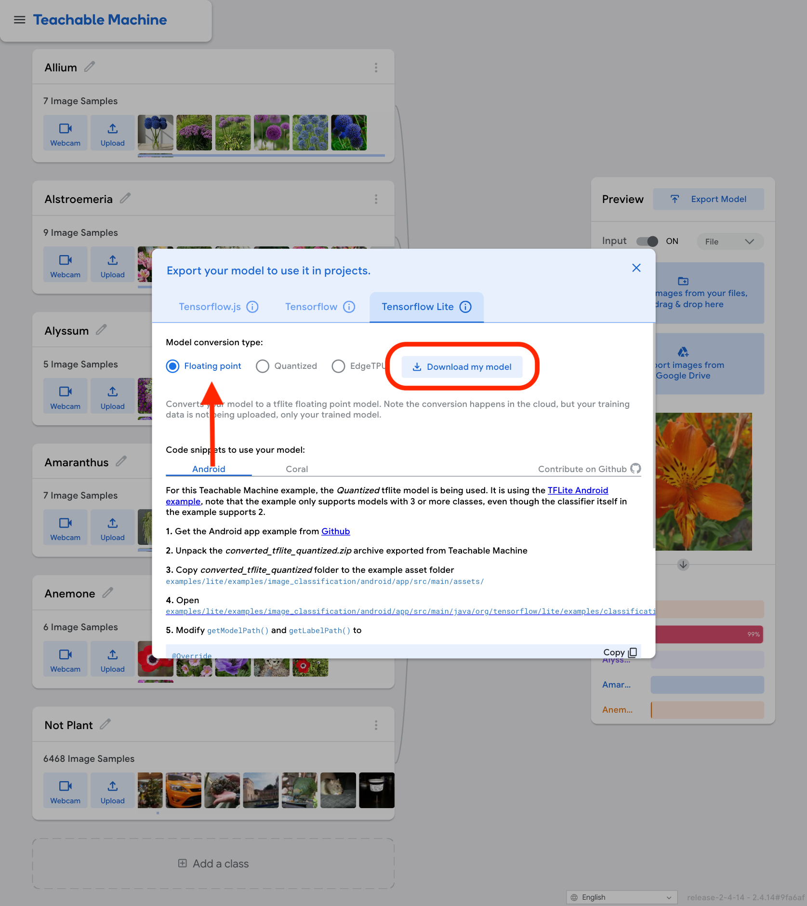

# 🌱 Plantify — Smart AI Plant Identifier & Care Guide

Plantify is a state-of-the-art mobile application built with **Flutter** that leverages **TensorFlow Lite (TFLite)** to perform real-time plant classification and provide actionable, rich botanical details. Whether you are scanning live video feeds or uploading photos from your gallery, Plantify delivers instant, precise predictions and interactive plant care guides.

---

## 📱 App Previews & Interface

<p align="center">
  
  
</p>

---

## ✨ Outstanding Features

- 🔋 **Zero-Latency Live Scan:** Continuous, high-performance camera streaming powered by Dart Background Isolates to perform image classification without lagging the UI.
- 🖼️ **Flexible Inputs:** Instantly analyze photos by taking a snapshot or choosing from your photo library.
- 📚 **Comprehensive Botanical Encyclopedia:** Gain access to scientific names, descriptions, and dynamic care instructions tailored to each classified plant genus.
- 🌍 **Fully Multilingual (i18n):** Complete localized UI support for English (US) and Arabic (SA) out-of-the-box.
- 🎨 **Premium Modern Design:** A gorgeously crafted user interface utilizing custom theme structures, fluid animations, shimmer loading states, and custom onboarding experiences.

---

## 🛠️ How to Create and Train Your Own Custom Model

You can train your own customized TensorFlow Lite image classification model using **Google Teachable Machine** without writing a single line of machine learning code. Follow these detailed steps:

### 1. Gather Dataset & Define Classes
- Navigate to [Google Teachable Machine](https://teachablemachine.withgoogle.com/) and create a new **Image Project** with **Standard Image Model**.
- Create distinct classes for each plant you want to recognize (e.g., *Allium*, *Alstroemeria*, etc.).
- **CRITICAL STEP:** Add a negative/idle class named `Not Plant` or similar. Upload images of fingers, empty spaces, tables, or random indoor items. This negative class index is vital to prevent the model from misclassifying random household items as plants.

<p align="center">
  
</p>

### 2. Train Your Classifier
- Use the **Train Model** action. Feel free to expand the *Advanced* settings to adjust epochs, batch size, or learning rate if needed (defaults usually perform well).
- Ensure your browser tab remains active during training.

<p align="center">
  
</p>

### 3. Export the TensorFlow Lite Model
- Once training completes, click **Export Model**.
- Choose the **TensorFlow Lite** tab.
- Select the **Floating point** (Float32) format and click **Download my model**.
- This yields a ZIP file containing `model.tflite` and `labels.txt`.

<p align="center">
  
</p>

---

## 🚀 How to Integrate Your Custom Model into Plantify

Integrating your freshly trained model is seamless. Follow these three steps:

### Step 1: Replace Model Assets
Place the downloaded files inside the asset folder:
1. Save the model in [assets/tflite/model.tflite](file:///Users/salem/Mobile/plantify/assets/tflite/model.tflite)
2. Save the labels in [assets/tflite/labels.txt](file:///Users/salem/Mobile/plantify/assets/tflite/labels.txt)

### Step 2: Configure the Negative Class Index
Open [lib/app/constants.dart](file:///Users/salem/Mobile/plantify/lib/app/constants.dart) and configure the `notPlantIndex` with the exact 0-based index of your negative `Not Plant` class from the `labels.txt` file.

For example, if your `labels.txt` is:
```text
0 Allium
1 Alstroemeria
2 Alyssum
3 Amaranthus
4 Anemone
5 Not Plant
```
The negative class index is `5`. Update it inside the `Constants` class:
```dart
class Constants {
  // ... other constants
  static const int notPlantIndex = 5; // Matches the index in labels.txt
}
```

### Step 3: Add Plant Botanical Details
Update the metadata registry in [assets/tflite/plants_details.json](file:///Users/salem/Mobile/plantify/assets/tflite/plants_details.json) to supply details for your new classes. The indices in JSON must align exactly with your model outputs:
```json
[
  {
    "index": 0,
    "name": "Allium",
    "scientificName": "Allium hollandicum",
    "description": "An ornamental hardy bulbous perennial...",
    "careInstructions": "Thrives best in full sun...",
    "image": "assets/flowers/Allium.png"
  },
  {
    "index": 5,
    "name": "Not Plant",
    "scientificName": null,
    "description": "Invalid botanical record. This data slot does not map to a recognized flowering plant.",
    "careInstructions": null,
    "image": ""
  }
]
```

---

## 🧱 Technical Architecture & Setup

### Requirements
- **Flutter SDK:** `^3.11.0` or higher
- **Android Target SDK:** `34` or higher
- **iOS Deployment Target:** `12.0` or higher

### Developer Command Reference

Clone and open the project directory:
```bash
cd /Users/salem/Mobile/plantify
```

Retrieve packages and configurations:
```bash
flutter pub get
```

Generate dynamic launcher icons and splash screens:
```bash
# Set up native launch screens
dart run flutter_native_splash:create

# Generate modern app icon layers
dart run flutter_launcher_icons
```

Run in Development mode:
```bash
flutter run
```

Analyze the codebase for lint or format errors:
```bash
flutter analyze
```

### Clean Architecture Directory Outline
The project adheres to highly decoupled Clean Architecture design principles:
```text
lib/
 ├── app/                      # Shared Services (File Picker, TFLite Recognition, Constants)
 ├── domain/                   # Business Models & Data Contracts
 ├── presentation/             # UI Components, Screens, Themes, state-management (BLoC/Cubit)
 │    ├── cubit/               # Core Application State Management
 │    ├── home/                # Main Home & Zero-Latency Live Camera Scan Screens
 │    ├── plant_details/       # Botanical cards & Care instructions pages
 │    ├── onboarding/          # Interactive introduction screens
 │    └── resources/           # Theme Configurations, Localization files & Widgets
 └── main.dart                 # Application Bootstrapper & Dependency Injection Container
```
